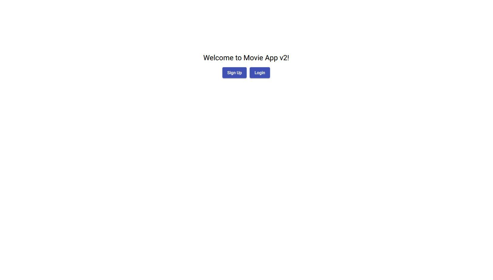
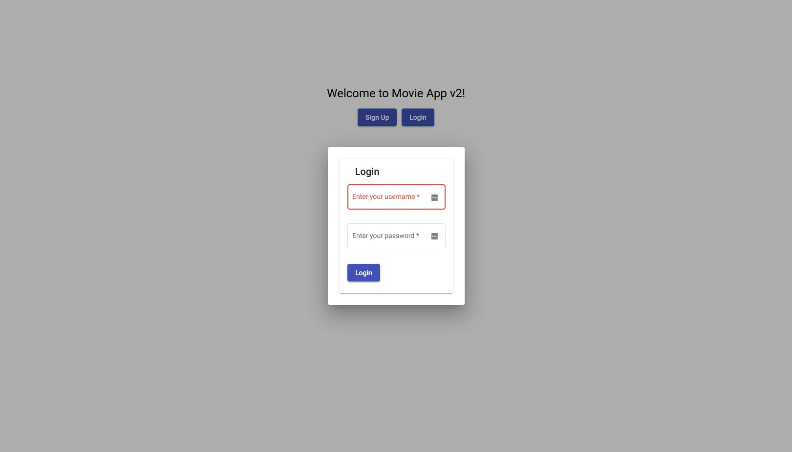
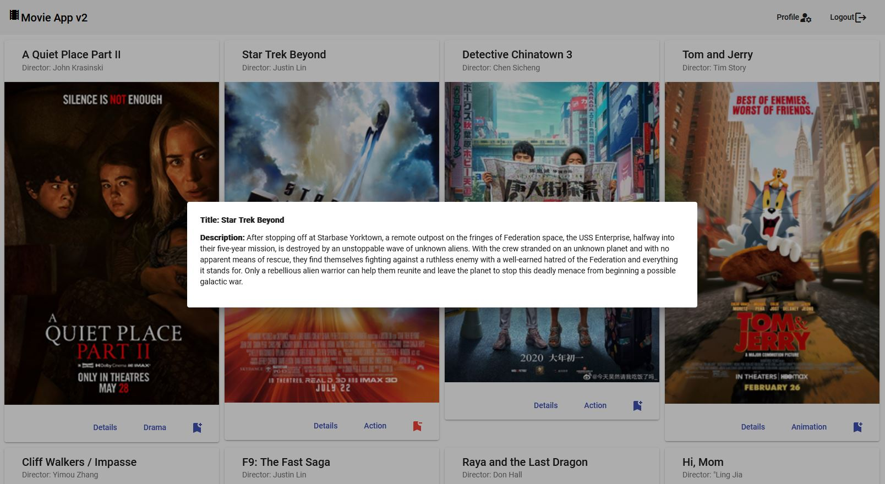
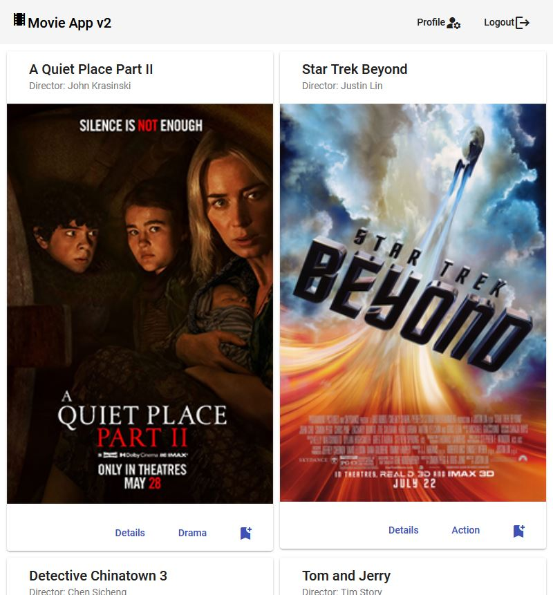
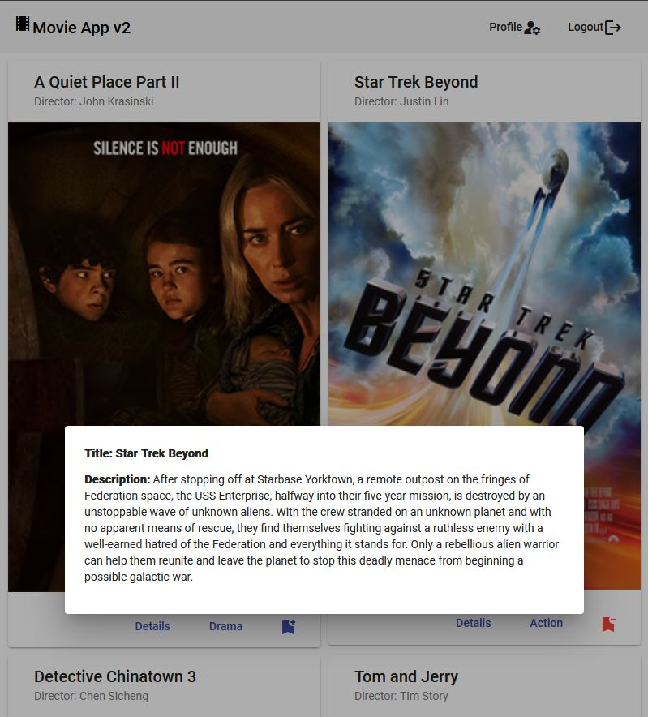
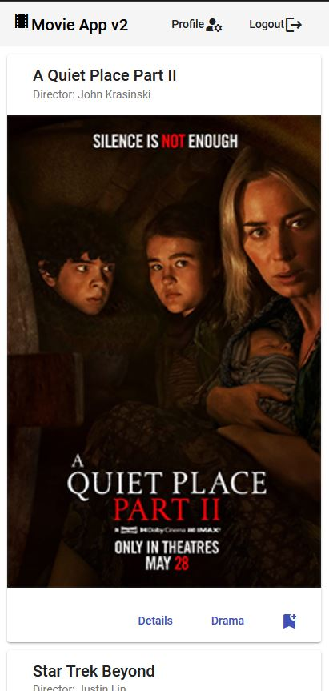
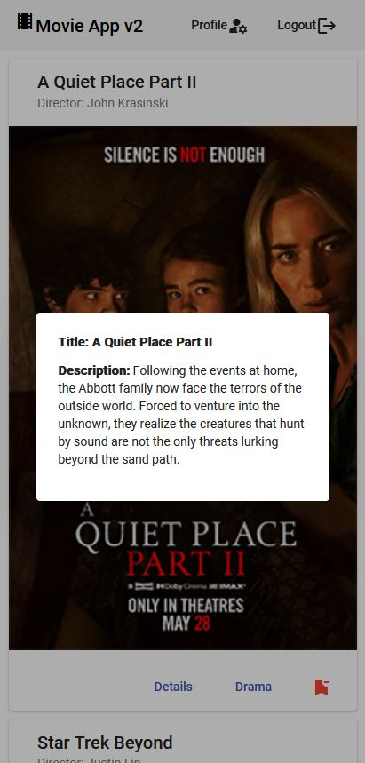

# Movie App v2. Technical Case Study

## Objective

Build a client-side app with TypeScript and Angular as Front-End and a REST API as Back-End.

## Context

Angular is a trendy framework used for a wide range of mobile and desktop applications. It's particularly well-suited to large projects and projects requiring a complex user interface because it comes with a variety of built-in modules and services.

## Project Owner, Management, and Acknowledgement

[CareerFoundry](https://careerfoundry.com/) (25.02.2021 - 17.03.2022)

## Project Owner and improvements

Nick Balan (18.03.2022 - now)

## My Role

- Full-Stack Web Developer

## The 5 W's

- Who? — The users of the Movie App v2 and codebase, including other web developers and designers
- What? — A single-page, responsive Movie App v2 built with Angular, routing, and several interface views. The client-side developed in this project supports the existing server-side from [Movie API](https://github.com/nickbalan/movie-api) by facilitating user requests and rendering the response from the server-side via several different interface views. The app includes relevant documentation and handoff deliverables, including a [Kanban board](https://trello.com/b/uaMESjar/a6-movie-app-kanban-project) containing user stories and story points
- When? — Users should be able to use the app whenever they want to read information about different movies or update their user information
- Where? — The app is hosted online. It is responsive and can therefore be used anywhere and on any device, giving all users an equal experience
- Why? — Movie enthusiasts should be able to access information about different movies, directors, and genres whenever they want. The app demonstrates my Angular skills and ability to create straightforward documentation for other developers and employers.

## User Stories

- As a user, I should be able to receive information on movies, directors, and genres so that I can learn more about movies I've watched or am interested in
- As a user, I should be able to create a profile so I can save data about my favorite movies.

## Technical Requirements & Solutions

- The application must use the [Movie API](https://github.com/nickbalan/movie-api) as Back-End
- The application must be written in Angular (version 9 or later)
- The application requires the latest version of Node.js and npm package
- The application must contain user registration and login forms
- The application must be designed using Angular Material UI
- The application's codebase must be documented using TypeDoc
- The project must be hosted on GitHub Pages.

## Technical Improvements & Solutions

### Done

- Updated the TypeDoc documentation
- Updated the components documentation.

## Breakdown Project Deliverables in Story Points

- Profile View Page -> 21 story points
- Registration Page -> 8 story points
- Login View Page -> 8 story points
- Movie List -> 8 story points
- Movie View Page -> 5 story points
- Movie Card -> 5 story points
- Genre View Page -> 5 story points
- Director View Page -> 5 story points
- Initiating the project and configuring the tools -> 2 story points
- Main View Page -> 21 story points
- Profile View Page -> 21 story points
- Registration Page -> 8 story points
- Login View Page -> 8 story points
- Movie List -> 8 story points
- Movie View Page -> 5 story points
- Movie Card -> 5 story points
- Genre View Page -> 5 story points
- Director View Page -> 5 story points
- Initiating the project and configuring the tools -> 2 story points.

## Key Features

- The app should display a welcome view where users will be able to either login or register an account.
- Once authenticated, the user should now view all movies
- Upon clicking on a particular movie, users are taken to a single movie view, where additional movie details are displayed. The single movie view will contain the following additional features:
  - A view details button, when clicked, takes a user to the director view​, where details about the director of that particular movie are displayed
  - A view details button, when clicked, takes a user to the ​genre view​, where details about that particular genre of the movie are displayed.

## Development server

This project was generated initially with [Angular CLI](https://github.com/angular/angular-cli) version 13.2.5.

Run `ng serve` for a dev server. Navigate to `http://localhost:4200/`. The app will automatically reload if you change any of the source files.

## Code scaffolding

Run `ng generate component component-name` to generate a new component. You can also use `ng generate directive|pipe|service|class|guard|interface|enum|module`.

## Build

Run `ng build` to build the project. The build artifacts will be stored in the `dist/` directory.

## Running unit tests

Run `ng test` to execute the unit tests via [Karma](https://karma-runner.github.io).

## Running end-to-end tests

Run `ng e2e` to execute the end-to-end tests via a platform of your choice. To use this command, you need first to add a package that implements end-to-end testing capabilities.

## Further help

To get more help on the Angular CLI, use `ng help` or check out the [Angular CLI Overview and Command Reference](https://angular.io/cli) page.

## Link to live hosted Movie App v2

Check out the [Movie App v2](https://nickbalan.github.io/movie-app-v2) live page.

## Movie App v2 screenshots

